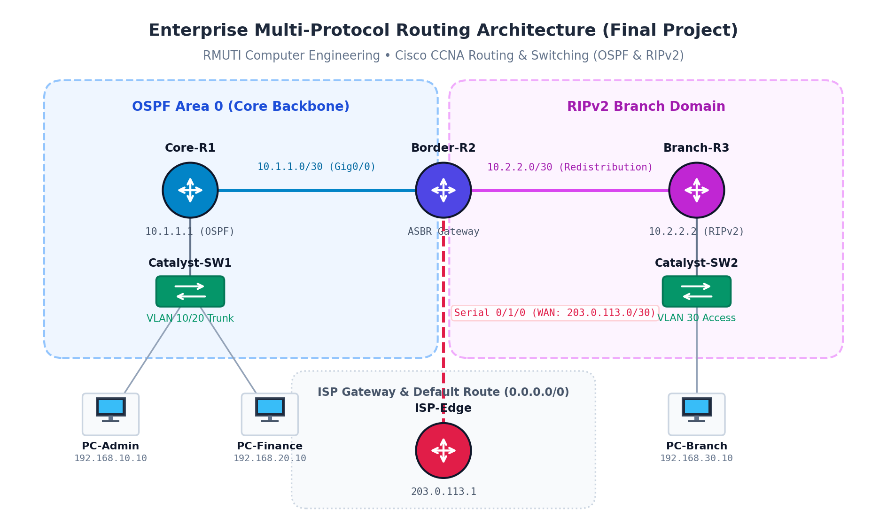
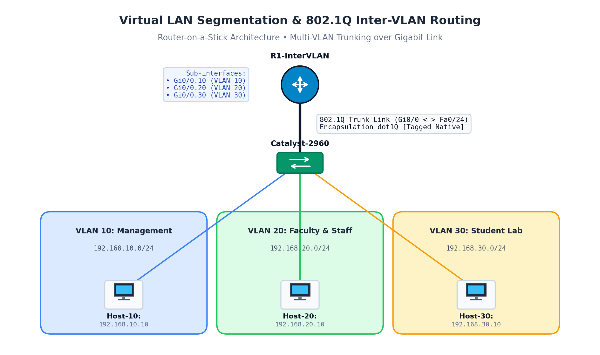
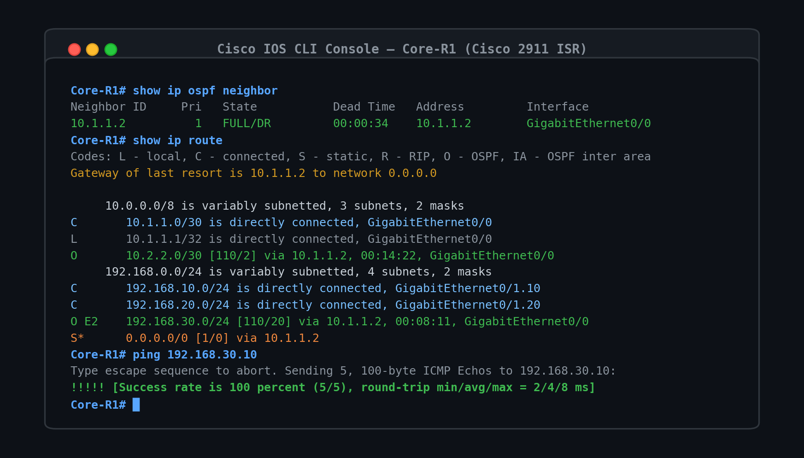
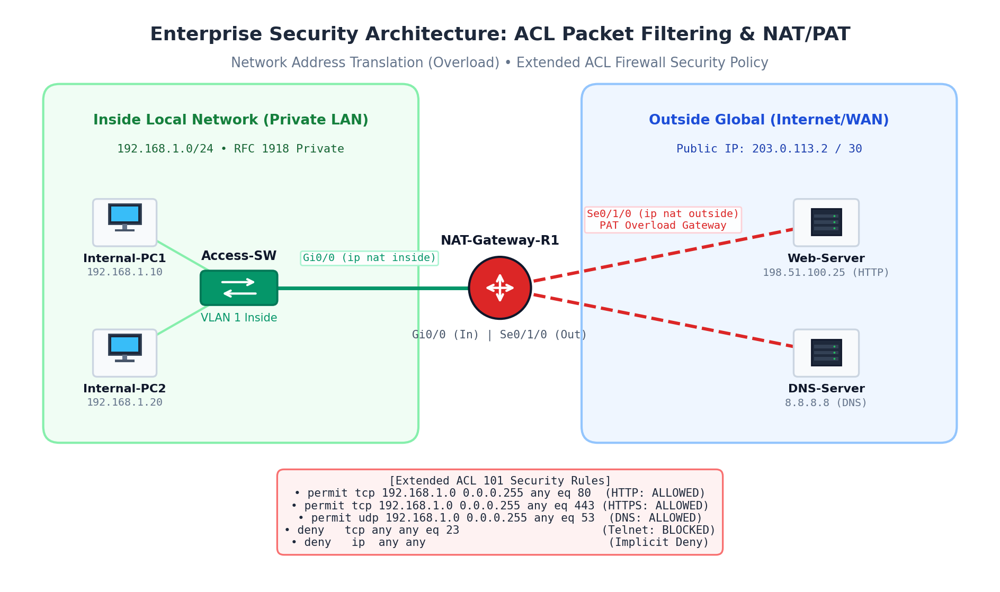

<div align="center">

# Cisco Network Engineering Coursework

**Enterprise Networking • Dynamic Routing Protocols • VLAN Segmentation • ACL & NAT Security**  
*Department of Computer Engineering, Faculty of Engineering and Architecture, RMUTI*

[](https://www.netacad.com/courses/packet-tracer)
[](https://www.cisco.com/c/en/us/training-events/training-certifications/certifications/associate/ccna.html)
[](https://datatracker.ietf.org/doc/html/rfc2328)
[](https://datatracker.ietf.org/doc/html/rfc3022)
[](tools/)
[](LICENSE)

</div>

---

## Executive Summary

This repository houses an engineering-grade collection of **Cisco Packet Tracer (`.pkt`)** network simulation architectures, modular lab blueprints, automated subnetting tools, and Cisco IOS configuration scripts developed throughout the Computer Networks & Data Communications curriculum.

All topologies follow standard **Cisco CCNA (Cisco Certified Network Associate)** routing, switching, and security guidelines — featuring 802.1Q virtual LAN segmentation, Router-on-a-Stick inter-VLAN routing, single-area OSPFv2 backbone convergence, RIPv2 mutual redistribution, Extended Access Control List (ACL) traffic filtering, and Port Address Translation (PAT / NAT Overload).

---

## Visual Architecture Showcase

<div align="center">
  <table>
    <tr>
      <td width="50%" align="center">
        <b>1. Multi-Protocol Enterprise Architecture (Final Project)</b><br/><br/>
        
      </td>
      <td width="50%" align="center">
        <b>2. VLAN Segmentation & 802.1Q Trunking (Lab 02)</b><br/><br/>
        
      </td>
    </tr>
    <tr>
      <td width="50%" align="center">
        <b>3. Cisco IOS CLI Console & Routing Table Simulation</b><br/><br/>
        
      </td>
      <td width="50%" align="center">
        <b>4. Enterprise Security Gateway: ACL & NAT/PAT (Lab 04)</b><br/><br/>
        
      </td>
    </tr>
  </table>
</div>

---

## Repository Structure & Topology Catalog

```
cisco-network-engineering-coursework/
├── final-project-routing-protocols/        # Capstone Multi-Site Enterprise Architecture
│   ├── README.md                           # Final project design documentation
│   └── topology/
│       └── Final-RoutingProtocols-1.pkt    # Complete OSPF + RIPv2 + ISP Edge simulation
├── labs/
│   ├── lab01-lan-switching-and-ip-addressing/
│   │   ├── README.md                       # L2 Ethernet, CAM tables, IPv4 addressing
│   │   └── topologies/
│   │       ├── Unite 1.pkt                 # P2P & star topology host configuration
│   │       ├── Unite2.pkt                  # Multi-switch broadcast domain analysis
│   │       └── Unite 3.pkt                 # Subnet boundary & default gateway verification
│   ├── lab02-vlan-trunking-and-switching/
│   │   ├── README.md                       # 802.1Q trunking, Router-on-a-Stick (RoaS)
│   │   └── topologies/
│   │       ├── LAB-2.1.pkt                 # Single-switch VLAN broadcast containment
│   │       ├── LAB-2.2.pkt                 # Multi-switch 802.1Q tagged uplinks
│   │       └── LAP-2.3.pkt                 # Router-on-a-Stick sub-interface routing
│   ├── lab03-dynamic-routing-protocols-rip-ospf/
│   │   ├── README.md                       # OSPFv2 Link-State & RIPv2 Distance-Vector
│   │   └── topologies/
│   │       ├── LAB-3.1.pkt                 # Multi-hop static route benchmark
│   │       ├── LAB-3.1-designed.pkt        # Optimized dual-homed physical layout
│   │       ├── LAB-3.2.pkt                 # RIPv2 split-horizon & VLSM updates
│   │       ├── LAB-3.3.pkt                 # Single-Area OSPFv2 backbone (Area 0)
│   │       └── final.pkt                   # Multi-protocol redistribution scenario
│   └── lab04-enterprise-services-acl-nat/
│       ├── README.md                       # Network security, ACLs, and NAT/PAT
│       └── topologies/
│           └── LAB-4.1.pkt                 # Extended ACL 101 & PAT Overload Gateway
├── tools/                                  # Algorithmic Network Automation Utilities
│   ├── vlsm_subnet_calculator.py           # RFC 1878 VLSM & CIDR address allocator
│   └── routing_table_simulator.py          # Dijkstra SPF & OSPF convergence engine
├── docs/
│   └── screenshots/                        # High-resolution architectural blueprints
│       ├── 01-final-routing-protocols-topology.png
│       ├── 02-vlan-trunking-topology.png
│       ├── 03-ospf-rip-routing-table-simulation.png
│       └── 04-acl-nat-security-topology.png
├── run_demo.py                             # 1-Command interactive demo & verification suite
├── LICENSE                                 # MIT Open Source License
└── .gitignore                              # Clean repository exclusion patterns
```

---

## Technical Competency Matrix

| Domain | Technical Topics | Hardware / IOS Models | Cisco Protocols & Standards |
| :--- | :--- | :--- | :--- |
| **Layer 2 Switching** | VLAN segmentation, 802.1Q trunking, DTP, Native VLAN | Cisco Catalyst 2960-24TT | IEEE 802.1Q, 802.3u, CAM tables |
| **Inter-VLAN Routing** | Router-on-a-Stick (RoaS), sub-interfaces, encapsulation | Cisco 1941, 2901, 2911 ISR | 802.1Q Sub-if tagging |
| **Interior Gateway Protocols** | Distance-Vector vs. Link-State, SPF algorithm, DR/BDR | Cisco 2911 Modular ISR | OSPFv2 (RFC 2328), RIPv2 (RFC 2453) |
| **Edge Route Redistribution** | ASBR mutual redistribution, default-information originate | Cisco 2911 Edge Router | Autonomous System Boundary Routing |
| **IPv4 Address Planning** | Variable-Length Subnet Masking (VLSM), CIDR, Wildcard | All Routers & Endpoints | RFC 1878, RFC 4632 |
| **Network Security** | Standard & Extended IP ACLs, port-based packet filtering | Cisco Security ISR | Named / Numbered ACLs (1-199) |
| **Address Translation** | Dynamic Port Address Translation (PAT / NAT Overload) | Cisco NAT Border Gateway | RFC 1631, RFC 3022 |

---

## Algorithmic Subnetting & Routing Tools

The `tools/` directory provides Python utilities to calculate subnets and simulate routing convergence without launching Packet Tracer:

### 1. VLSM Subnet Calculator (`tools/vlsm_subnet_calculator.py`)
Allocates subnets in descending host count order, guaranteeing optimal IP block efficiency:

```bash
python tools/vlsm_subnet_calculator.py
```

```
==============================================================================================
  CISCO CCNA VLSM SUBNET ALLOCATION TABLE — Base: 192.168.0.0/24
==============================================================================================
Subnet / Segment          | Req  | Alloc | Network / CIDR     | Usable Range                   
----------------------------------------------------------------------------------------------
VLAN 20 (Faculty/Staff)   | 60   | 62    | 192.168.0.0/26     | 192.168.0.1 - 192.168.0.62     
VLAN 10 (Management)      | 28   | 30    | 192.168.0.64/27    | 192.168.0.65 - 192.168.0.94    
VLAN 30 (Student Lab)     | 14   | 14    | 192.168.0.96/28    | 192.168.0.97 - 192.168.0.110   
WAN Link (R1-R2 P2P)      | 2    | 2     | 192.168.0.112/30   | 192.168.0.113 - 192.168.0.114  
WAN Link (R2-R3 P2P)      | 2    | 2     | 192.168.0.116/30   | 192.168.0.117 - 192.168.0.118  
==============================================================================================
```

### 2. OSPF Dijkstra SPF Simulator (`tools/routing_table_simulator.py`)
Computes least-cost paths and builds the routing information base (RIB):

```bash
python tools/routing_table_simulator.py
```

### 3. One-Command Interactive Demo Suite (`run_demo.py`)
Validates all 13 `.pkt` files and executes the subnet and routing engines simultaneously:

```bash
python run_demo.py
```

---

## Cisco IOS Configuration Blueprint Reference

### 1. 802.1Q Inter-VLAN Router-on-a-Stick
```cisco
interface GigabitEthernet0/0.10
 encapsulation dot1Q 10
 ip address 192.168.10.1 255.255.255.0
!
interface GigabitEthernet0/0.20
 encapsulation dot1Q 20
 ip address 192.168.20.1 255.255.255.0
```

### 2. Single-Area OSPFv2 Backbone (Area 0)
```cisco
router ospf 1
 router-id 1.1.1.1
 network 10.1.1.0 0.0.0.3 area 0
 network 192.168.10.0 0.0.0.255 area 0
 passive-interface GigabitEthernet0/0.10
```

### 3. Extended ACL 101 & PAT Overload
```cisco
ip access-list extended ENTERPRISE_FIREWALL
 permit tcp 192.168.1.0 0.0.0.255 any eq 80
 permit tcp 192.168.1.0 0.0.0.255 any eq 443
 permit udp 192.168.1.0 0.0.0.255 any eq 53
 deny tcp any any eq 23
 deny ip any any
!
access-list 1 permit 192.168.1.0 0.0.0.255
ip nat inside source list 1 interface Serial0/1/0 overload
```

---

## Getting Started & Software Requirements

1. **Cisco Packet Tracer**: Download and install [Cisco Packet Tracer](https://www.netacad.com/courses/packet-tracer) (Version 8.0 or newer recommended).
2. **Open Topology**:
   - Launch Cisco Packet Tracer.
   - Click `File -> Open` (or `Ctrl+O`) and navigate to any desired `.pkt` file inside `labs/` or `final-project-routing-protocols/`.
3. **Simulation Mode**:
   - Toggle to **Simulation Mode** (`Shift+S`) to inspect packet PDUs (ARP, ICMP, OSPF Hello, RIP Updates) traversing the network step-by-step.

---

## License

This project is open-source and licensed under the [MIT License](LICENSE).
