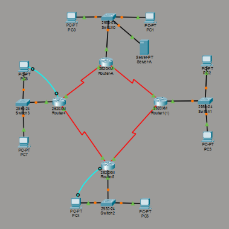

# Lab 01: LAN Switching Fundamentals & IP Addressing

## Overview
Lab 01 establishes foundational campus local area networking (LAN) concepts, focusing on Layer 2 Ethernet switching, collision and broadcast domain isolation, media access control (MAC) address tables, and structured IPv4 classful/classless addressing.

---

## Lab Architecture & Packet Tracer Topology

<div align="center">
  
  <p><i>Figure 1.1: Multi-Router Ring Backbone with Switched Workstations and Out-of-Band Console Rollover Management</i></p>
</div>

### Topology Hardware & Link Inventory
- **Core Routed Backbone**: 4x Cisco 2620XM Modular Routers (`Router-A`, `Router1(1)`, `Router3`, `Router4`) interconnected in a redundant ring via WIC-2T Serial red DTE/DCE interfaces.
- **Access Switching Layer**: 4x Cisco Catalyst 2950-24 Switches (`Switch0`, `Switch1`, `Switch2`, `Switch3`) providing FastEthernet LAN access.
- **Endpoint Hosts**: 8x Host PCs (`PC0` - `PC7`) distributed across departmental access switches.
- **Network Services**: 1x Central File & TFTP Server (`Server-A`) connected to `Switch0`.
- **Out-of-Band (OOB) Management**: Rollover console connections (cyan cables) from `PC6 -> Router4 Console` and `PC4 -> Router3 Console`.

---

## Lab Review & Theoretical Q&A (คำถามท้ายบทปฏิบัติการ)

| ข้อที่ | คำถาม (Theoretical Topic) | คำตอบที่ถูกต้อง (Cisco Standards) | คำอธิบายทางวิศวกรรม (Engineering Rationale) |
| :--- | :--- | :--- | :--- |
| **1** | **ตำแหน่งสำหรับบันทึก/จัดเก็บคุณสมบัติอุปกรณ์ประกอบด้วยอะไรบ้าง?** | • **Running-config** (RAM)<br/>• **Startup-config** (NVRAM)<br/>• **Flash Memory**<br/>• **Server อยู่นอกเครื่อง** (TFTP / FTP) | RAM ทำหน้าที่เก็บการตั้งค่าชั่วคราวขณะเปิดเครื่อง ส่วน NVRAM จะเก็บคอนฟิกถาวรเพื่อโหลดตอนบูต และ Flash Memory ใช้จัดเก็บระบบปฏิบัติการ Cisco IOS |
| **2** | **ยกตัวอย่างคำสั่ง `copy` ที่ให้แทนคำสั่ง `write`?** | `copy running-config startup-config`<br/>*(หรือย่อเป็น `copy run start`)* | คำสั่งมาตรฐานของ Cisco IOS ในการคัดลอกไฟล์คอนฟิกจาก RAM ไปยัง NVRAM เทียบเท่ากับคำสั่งโบราณ `write memory` (`wr`) |
| **3** | **คุณสมบัติของไฟล์คอนฟิกอุปกรณ์เป็นไฟล์แบบใด?** | **Text File (ASCII Plain Text)** | ไฟล์คอนฟิกของ Cisco อุปกรณ์เครือข่ายถูกจัดเก็บในรูปแบบไฟล์ข้อความธรรมดา (Human-readable ASCII Text) สามารถเปิดดูด้วยโปรแกรม Text Editor ทั่วไปได้ |
| **4** | **ยกตัวอย่างโปรแกรม TFTP Server ที่ใช้ในคอมพิวเตอร์?** | • **Tftpd64 / Tftpd32**<br/>• **SolarWinds TFTP Server**<br/>• **Cisco TFTP Server** | โปรแกรมจำลองโปรโตคอล TFTP (UDP Port 69) แบบ Lightweight นิยมใช้ในการแบ็กอัป/กู้คืนคอนฟิกและอัปเกรดเฟิร์มแวร์ IOS ผ่านเครือข่ายแล็บ |

---

## Network Topologies in Repository (`topologies/`)
- [`Unite 1.pkt`](topologies/Unite%201.pkt): Peer-to-peer and star topology host configuration with static IPv4 addressing and ICMP reachability verification.
- [`Unite2.pkt`](topologies/Unite2.pkt): Multi-switch hierarchical topology exploring broadcast propagation and ARP resolution.
- [`Unite 3.pkt`](topologies/Unite%203.pkt): End-to-end host-to-gateway verification with default gateways and subnet boundary analysis.

---

## Cisco IOS Reference Commands
```cisco
! 1. Memory & Configuration Management
Router# copy running-config startup-config
Destination filename [startup-config]? [Enter]
Building configuration...
[OK]

! Backup configuration to remote TFTP Server
Router# copy running-config tftp:
Address or name of remote host []? 192.168.1.100
Destination filename [router-confg]? Core-R1.cfg
!!
[OK - 1842 bytes]

! 2. Memory & Hardware Verification
Router# show running-config
Router# show startup-config
Router# show version
Router# show flash:

! 3. Switch MAC Address Table Verification
Switch# show mac address-table
Switch# show interfaces status
```
