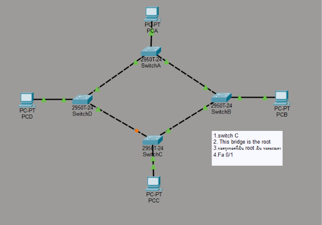

# Lab 02: Virtual LAN (VLAN), Spanning Tree Protocol & WLAN

## Overview
Lab 02 explores enterprise campus switching technologies across three progressive modules:
1. **Lab 2.1**: Multi-Switch Virtual LAN (VLAN) logical segmentation and broadcast containment.
2. **Lab 2.2**: Spanning Tree Protocol (STP / IEEE 802.1D) loop prevention, Root Bridge election, and port states.
3. **Lab 2.3**: Wireless LAN (WLAN) integration using Cisco/Linksys WRT300N wireless routers with central switched infrastructure.

---

## 1. Lab 2.1: Multi-Switch VLAN Segmentation

<div align="center">
  
  <p><i>Figure 2.1: Dual-VLAN Segmentation (VLAN 11 Green &amp; VLAN 12 Yellow) across 4 Interconnected Catalyst 2950 Switches</i></p>
</div>

### Logical VLAN Assignment Matrix
| VLAN ID | VLAN Name | Subnet / Network | Member Endpoints | Access Switch & Ports |
| :--- | :--- | :--- | :--- | :--- |
| **VLAN 11** | `VLAN_Green` | `192.168.0.0/24` | • `PCA1` (`192.168.0.1`)<br/>• `PCA2` (`192.168.0.2`)<br/>• `PCB` (`192.168.0.3`)<br/>• `PCC` (`192.168.0.4`)<br/>• `PCD` (`192.168.0.5`) | `SwitchA`, `SwitchB`, `SwitchC`, `SwitchD` (Access Ports) |
| **VLAN 12** | `VLAN_Yellow` | `192.168.0.0/24` | • `PCXA1` (`192.168.0.11`)<br/>• `PCXA2` (`192.168.0.12`)<br/>• `PCXB` (`192.168.0.13`)<br/>• `PCXC` (`192.168.0.14`)<br/>• `PCXD` (`192.168.0.15`) | `SwitchA`, `SwitchB`, `SwitchC`, `SwitchD` (Access Ports) |

### Engineering Highlights & Behavior
- **Broadcast Isolation**: Endpoints in VLAN 11 (`192.168.0.1` - `.5`) can communicate directly with each other across switches, but are completely isolated from endpoints in VLAN 12 (`192.168.0.11` - `.15`) despite sharing the same physical switch infrastructure and IP subnet.
- **Switch Verification Commands**:
  ```cisco
  Switch> enable
  Switch# show vlan brief
  Switch# show running-config
  Switch# write
  ```

---

## 2. Lab 2.2: Spanning Tree Protocol (STP) & Root Bridge Election

<div align="center">
  
  <p><i>Figure 2.2: IEEE 802.1D Spanning Tree Protocol Topology with Switch C Elected as Root Bridge and Blocking Port Fa 0/1</i></p>
</div>

### STP Analysis & Lab Verification Q&A (สรุปผลการทดลอง)

| ข้อที่ | ประเด็นการทดสอบ (STP Verification) | ผลการวิเคราะห์ / คำตอบ (Verified Result) | คำอธิบายทางวิศวกรรม (Technical Rationale) |
| :--- | :--- | :--- | :--- |
| **1** | **สวิตช์ใดทำหน้าที่เป็น Root Bridge?** | **Switch C** | สวิตช์ที่มีค่า Bridge ID ต่ำที่สุด (Default Priority 32768 + MAC Address ต่ำที่สุด) จะได้รับการเลือกเป็น Root Bridge ประจำระบบ |
| **2** | **ข้อความระบุสถานะบน Root Bridge ใน Cisco IOS?** | **"This bridge is the root"** | ผลลัพธ์จากการรันคำสั่ง `show spanning-tree` บน Switch C เพื่อยืนยันว่าสวิตช์นี้เป็นจุดศูนย์กลางของ Spanning Tree |
| **3** | **สถานะของพอร์ตทั้งหมดบน Root Bridge?** | **พอร์ตทุกพอร์ตเป็น Designated Port (Forwarding)** | พอร์ตทั้งหมดบน Root Bridge จะทำหน้าที่ส่งต่อเฟรมข้อมูลเสมอ (Designated Ports ในสถานะ Forwarding) โดยไม่มีพอร์ตใดถูกบล็อก |
| **4** | **พอร์ตใดถูกบล็อกเพื่อป้องกัน Switching Loop?** | **FastEthernet 0/1 (Fa 0/1) บนสวิตช์ที่ไม่ใช่รูท** | STP ทำการบล็อกพอร์ต (Alternate/Blocking Port - จุดสีส้ม) เพื่อตัดลูปในระดับเลเยอร์ 2 ป้องกัน Broadcast Storm และ MAC Flapping |

---

## 3. Lab 2.3: Wireless LAN (WLAN) Integration

<div align="center">
  
  <p><i>Figure 2.3: Multi-AP Wireless LAN (WRT300N) Connected to Central Catalyst Switch and Campus Server</i></p>
</div>

### Architecture Specifications
- **Wireless Access Tier**: 3x Linksys/Cisco WRT300N Wireless Routers (`Wireless Router0`, `Wireless Router1`, `Wireless Router2`).
- **Endpoint Mobility**: Wireless Laptops (`Laptop0`, `Laptop1`, `Laptop2`) connected via 802.11b/g/n wireless association.
- **Distribution & Core**: Catalyst 2950T-24 (`Switch0`) aggregating wired links from all three wireless routers to the central Campus Server (`Server0`).

---

## 4. Router-on-a-Stick (RoaS) 802.1Q Configuration Blueprint

```cisco
! 1. Catalyst 2960 Trunk Port
Switch(config)# interface FastEthernet 0/24
Switch(config-if)# switchport mode trunk
Switch(config-if)# switchport trunk allowed vlan 10,20,30

! 2. Cisco 2911 ISR Router-on-a-Stick (RoaS) Sub-interfaces
Router(config)# interface GigabitEthernet 0/0
Router(config-if)# no shutdown

Router(config)# interface GigabitEthernet 0/0.10
Router(config-subif)# encapsulation dot1Q 10
Router(config-subif)# ip address 192.168.10.1 255.255.255.0

Router(config)# interface GigabitEthernet 0/0.20
Router(config-subif)# encapsulation dot1Q 20
Router(config-subif)# ip address 192.168.20.1 255.255.255.0
```

---

## Topologies in Repository (`topologies/`)
- [`LAB-2.1.pkt`](topologies/LAB-2.1.pkt): Multi-Switch dual-VLAN segmentation topology.
- [`LAB-2.2.pkt`](topologies/LAB-2.2.pkt): Spanning Tree Protocol (STP) Root Bridge and loop prevention topology.
- [`LAP-2.3.pkt`](topologies/LAP-2.3.pkt): Wireless LAN (WRT300N) with central switch and server topology.
