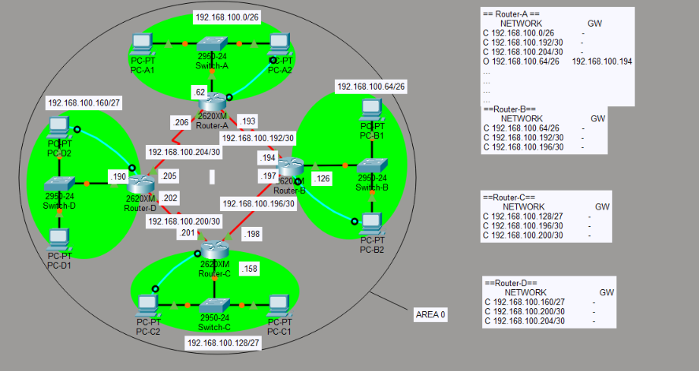

# Lab 03: Dynamic Routing Protocols (VLSM, RIP & OSPF Area 0)

## Overview
Lab 03 covers interior gateway routing protocols (IGPs) and classless IP address planning across three progressive architectural stages:
1. **Lab 3.1**: Multi-Router Variable Length Subnet Masking (VLSM) mathematical derivation and physical topology design.
2. **Lab 3.2**: Distance-Vector dynamic routing using RIP (Routing Information Protocol) with hop-count metrics and routing table convergence.
3. **Lab 3.3**: Link-State dynamic routing using Single-Area OSPFv2 (Area 0 Backbone) with Dijkstra Shortest Path First (SPF) route calculations.

---

## 1. Lab 3.1: Multi-Router VLSM Subnetting Architecture

<div align="center">
  
  <p><i>Figure 3.1: Multi-Router VLSM Ring Topology with Hierarchical Binary Subnet Allocation Breakdown</i></p>
</div>

### Hierarchical VLSM Subnet Allocation Model
Derived from Class C base address `192.168.100.0/24` (`255.255.255.0`):

| ลำดับการแบ่ง (Stage) | Prefix / Subnet Mask | วงเครือข่าย (Subnet ID) | วัตถุประสงค์การใช้งาน (Usage / Destination) |
| :--- | :--- | :--- | :--- |
| **Stage 1 (แบ่ง 4 วงย่อย)** | `/26` (`255.255.255.192`) | `192.168.100.0/26` | **LAN A**: `Switch-A`, `PC-A1` (`.2`), `PC-A2` (`.3`), Gateway `Router-A` (`.1`) |
| | `/26` (`255.255.255.192`) | `192.168.100.64/26` | **LAN B**: `Switch-B`, `PC-B1` (`.66`), `PC-B2` (`.67`), Gateway `Router-B` (`.65`) |
| | `/26` (`255.255.255.192`) | `192.168.100.128/26` | สำรองสำหรับแบ่งย่อยใน Stage 2 (LAN C &amp; LAN D) |
| | `/26` (`255.255.255.192`) | `192.168.100.192/26` | สำรองสำหรับแบ่งย่อยใน Stage 3 (Point-to-Point WAN Links) |
| **Stage 2 (แบ่งย่อย Stage 1.3)** | `/27` (`255.255.255.224`) | `192.168.100.128/27` | **LAN C**: `Switch-C`, `PC-C1` (`.130`), `PC-C2` (`.131`), Gateway `Router-C` (`.129`) |
| | `/27` (`255.255.255.224`) | `192.168.100.160/27` | **LAN D**: `Switch-D`, `PC-D1` (`.194`), `PC-D2` (`.195`), Gateway `Router-D` (`.193`) |
| **Stage 3 (Point-to-Point Links)** | `/30` (`255.255.255.252`) | `192.168.100.192/30` | **WAN 1**: Serial Link `Router-A` (`.193`) &harr; `Router-B` (`.194`) |
| | `/30` (`255.255.255.252`) | `192.168.100.196/30` | **WAN 2**: Serial Link `Router-B` (`.197`) &harr; `Router-C` (`.198`) |
| | `/30` (`255.255.255.252`) | `192.168.100.200/30` | **WAN 3**: Serial Link `Router-C` (`.201`) &harr; `Router-D` (`.202`) |
| | `/30` (`255.255.255.252`) | `192.168.100.204/30` | **WAN 4**: Serial Link `Router-D` (`.205`) &harr; `Router-A` (`.206`) |

---

## 2. Lab 3.2: Distance-Vector Routing with RIP

<div align="center">
  
  <p><i>Figure 3.2: RIP Dynamic Routing Architecture with 4 Departmental LANs and Router Routing Tables</i></p>
</div>

### Routing Information Base (RIB) Analysis
- **Directly Connected (`C`)**: Subnets attached directly to local router interfaces have an administrative distance and metric of `0`.
- **Dynamic RIP Routes (`R`)**: Learned periodically via UDP Port 520 broadcast/multicast updates from neighboring routers.
- **Hop Count Metric**: RIP calculates distance purely by the number of router hops (Max 15 hops; 16 hops indicates unreachable).

---

## 3. Lab 3.3: Link-State Routing with OSPFv2 (Area 0 Backbone)

<div align="center">
  
  <p><i>Figure 3.3: Single-Area OSPFv2 (Area 0) Backbone Convergence with Link-State Dynamic Routing Tables</i></p>
</div>

### OSPF Area 0 Engineering Highlights
- **Link-State Database (LSDB)**: Every router maintains a synchronized map of the complete network topology using Link State Advertisements (LSAs).
- **Dijkstra SPF Algorithm**: Each router independently computes the shortest path tree rooted at itself to determine the lowest-cost path:
  $$	ext{Cost} = rac{	ext{Reference Bandwidth (100 Mbps)}}{	ext{Interface Bandwidth}}$$
- **Routing Table Output (`O`)**: Displays dynamically learned routes with corresponding next-hop IP addresses (e.g., `O 192.168.100.64/26 via 192.168.100.194`).

---

## Protocol Comparison Matrix

| Feature | RIPv2 | OSPFv2 |
| :--- | :--- | :--- |
| **Protocol Type** | Distance-Vector (Bellman-Ford) | Link-State (Dijkstra SPF) |
| **Routing Metric** | Hop Count (Max 15) | Cost (Inverse of Bandwidth) |
| **Convergence Speed** | Slow (30-second periodic timer) | Immediate (Triggered LSA flooding) |
| **Network Hierarchy** | Flat / Single-tier | Hierarchical (Backbone Area 0 + Regular Areas) |
| **Administrative Distance** | 120 | 110 |
| **Multicast Addressing** | `224.0.0.9` | `224.0.0.5` (All Routers), `224.0.0.6` (DR/BDR) |

---

## Cisco IOS Routing Configuration

```cisco
! 1. RIPv2 Configuration (Router-A)
Router-A(config)# router rip
Router-A(config-router)# version 2
Router-A(config-router)# no auto-summary
Router-A(config-router)# network 192.168.100.0
Router-A(config-router)# passive-interface FastEthernet 0/0

! 2. OSPFv2 Area 0 Configuration (Router-A)
Router-A(config)# router ospf 1
Router-A(config-router)# router-id 1.1.1.1
Router-A(config-router)# network 192.168.100.0 0.0.0.63 area 0
Router-A(config-router)# network 192.168.100.192 0.0.0.3 area 0
Router-A(config-router)# network 192.168.100.204 0.0.0.3 area 0
Router-A(config-router)# passive-interface FastEthernet 0/0
```

---

## Topologies in Repository (`topologies/`)
- [`LAB-3.1.pkt`](topologies/LAB-3.1.pkt): Multi-router baseline ring topology.
- [`LAB-3.1-designed.pkt`](topologies/LAB-3.1-designed.pkt): Optimized physical layout and link design.
- [`LAB-3.2.pkt`](topologies/LAB-3.2.pkt): RIP dynamic routing simulation topology.
- [`LAB-3.3.pkt`](topologies/LAB-3.3.pkt): Single-Area OSPFv2 (Area 0) backbone topology.
- [`final.pkt`](topologies/final.pkt): Enterprise dynamic routing convergence scenario.
